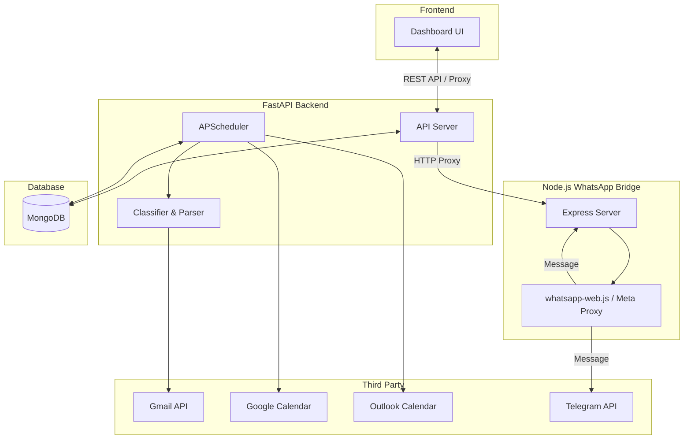

# Architecture Overview

Gmail Reminder is a multi-service system designed to monitor Gmail accounts, classify incoming emails, extract deadlines, and send reminders to various notification channels.

## Component Roles

1. **Dashboard UI (Frontend)**:
   - Built with Vanilla HTML/CSS/JS.
   - Served by FastAPI, communicates with the backend via REST endpoints.
   - Provides a unified control center for mailboxes, destinations, routing rules, email logs, and WhatsApp configuration.

2. **FastAPI Server & Scheduler (Backend)**:
   - Polls configured Gmail accounts in background threads.
   - Parses email headers and body text.
   - Classifies emails into categories (Exam, Assignment, etc.) and extracts deadlines (via Regex or optional Anthropic LLM).
   - Routes due notifications to WhatsApp/Telegram bridges.
   - Synchronizes deadlines to Google and Outlook calendars.

3. **WhatsApp Bridge**:
   - A standalone Node.js service that runs an Express server.
   - Operates in one of two modes: `webjs` (unofficial Puppeteer-based session allowing group posts) or `meta` (official ToS-compliant Cloud API for 1:1 notifications).

4. **MongoDB**:
   - Stores accounts, destinations, routing rules, classified emails, scheduled reminders, and sync states.
